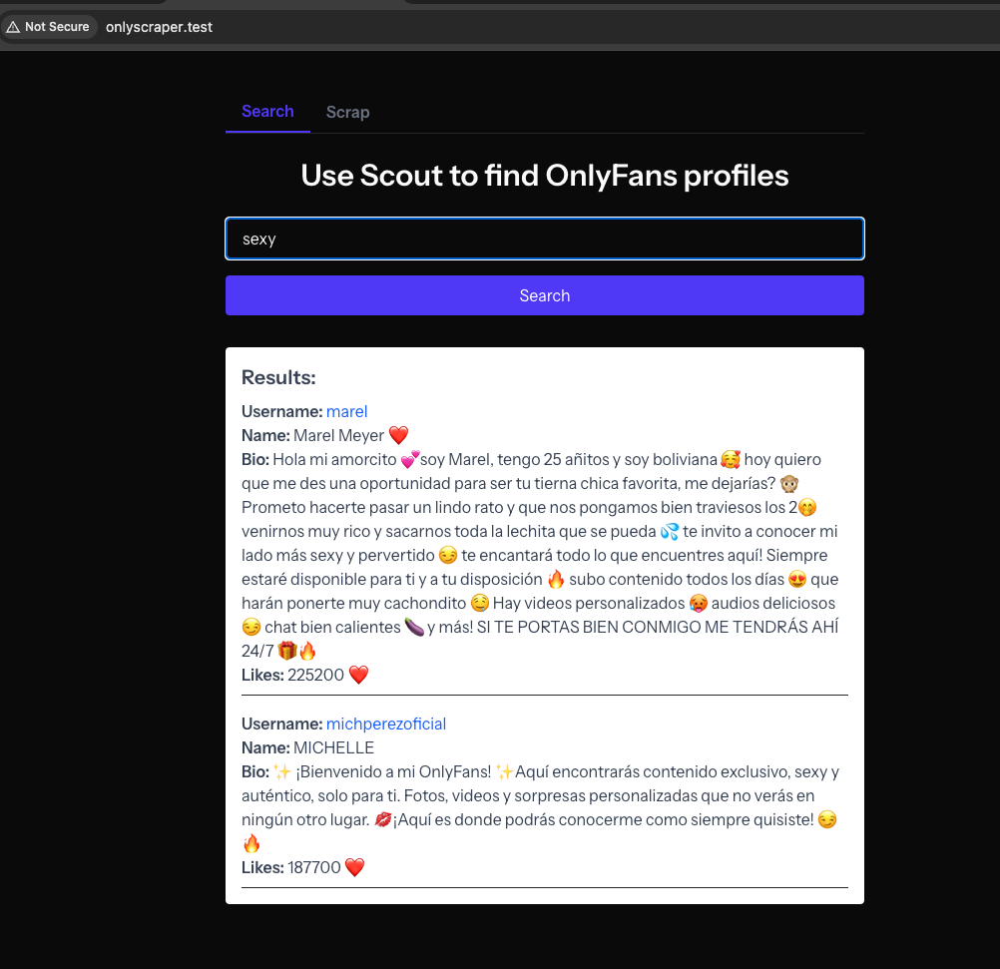
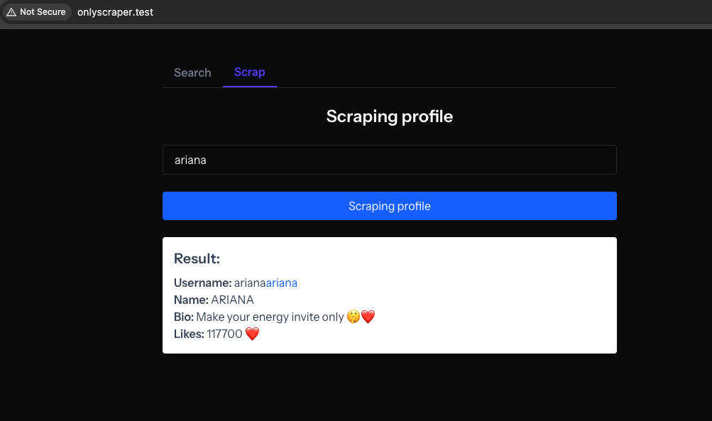

## Scraper Setup Instructions

To enable scraping, a browser client using Playwright was implemented, since the latest version of Laravel Playwright is not yet optimized for Laravel 12.

### Steps to Start the Scraper

1. Navigate to the `onlyfans-scraper/` directory.
2. Run `npm install`.
3. Then start the scraper server with `node server.js`.

The scraper will be available at:

```
http://localhost:3000
```

Make sure to add the following variable to your Laravel `.env` file:

```
SCRAPER_API_URL=http://localhost:3000
```

# OnlyFans Artisan Commands

This project includes a suite of Artisan commands to scrape and manage OnlyFans profiles asynchronously using Laravel queues and Horizon.

## Available Commands

### 🔍 Search & Username Generation

- **`onlyfans:generate-fake-usernames`**  
  Create random usernames using Faker and optionally dispatch scraping jobs.  
  **Usage:**  
  ```bash
  php artisan onlyfans:generate-fake-usernames --dispatch --limit=20
  ```

- **`onlyfans:generate-usernames`**  
  Generate likely OnlyFans usernames from a given prefix using heuristic patterns. Can also dispatch scraping jobs.  
  **Usage:**  
  ```bash
  php artisan onlyfans:generate-usernames gabi --dispatch --limit=50
  ```

---

### 🕵️‍♂️ Scraping

- **`onlyfans:scrape`**  
  Scrape a single OnlyFans profile and create or update the corresponding database record.  
  **Usage:**  
  ```bash
  php artisan onlyfans:scrape username123
  ```

- **`onlyfans:scrape-all`**  
  Dispatch scraping jobs for all stored usernames in the database.

- **`onlyfans:scrape-popular`**  
  Dispatch scraping jobs for profiles with more than 100,000 likes. Intended to run every 24 hours.

- **`onlyfans:scrape-regular`**  
  Dispatch scraping jobs for profiles with less than 100,000 likes. Intended to run every 72 hours.

---

## Notes

- All scraping is handled asynchronously via Laravel Horizon and queues.

## Screenshots



